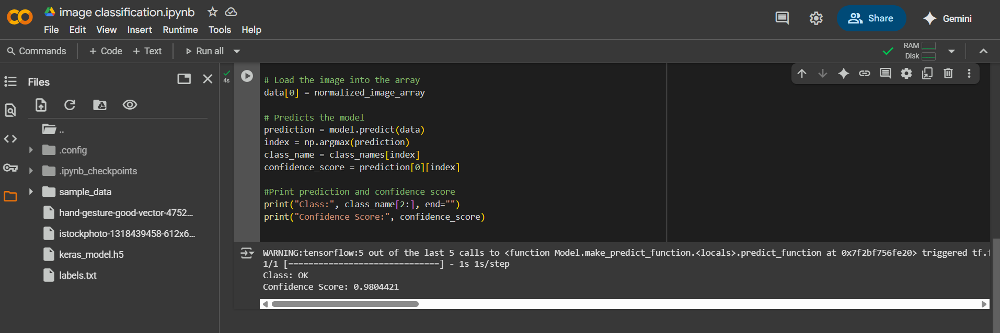
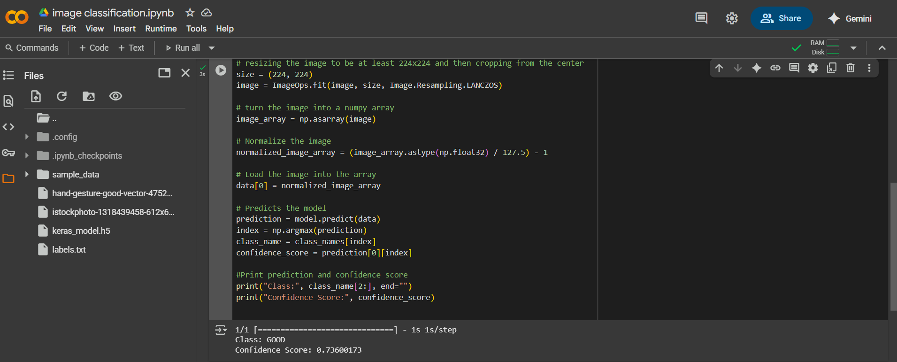

# Task1-ImageClassification

Hand Gesture Classification using Teachable Machine and Keras
Overview
This project demonstrates how to build a simple hand gesture classification model using Teachable Machine by Google, and run predictions using Python and TensorFlow (Keras) with confidence score.
The model classifies hand gestures into the following categories:
Good, 
Hi, 
Ok
### Example Output

**Test Image 1 Prediction:**  

**Test Image 2 Prediction:**  

